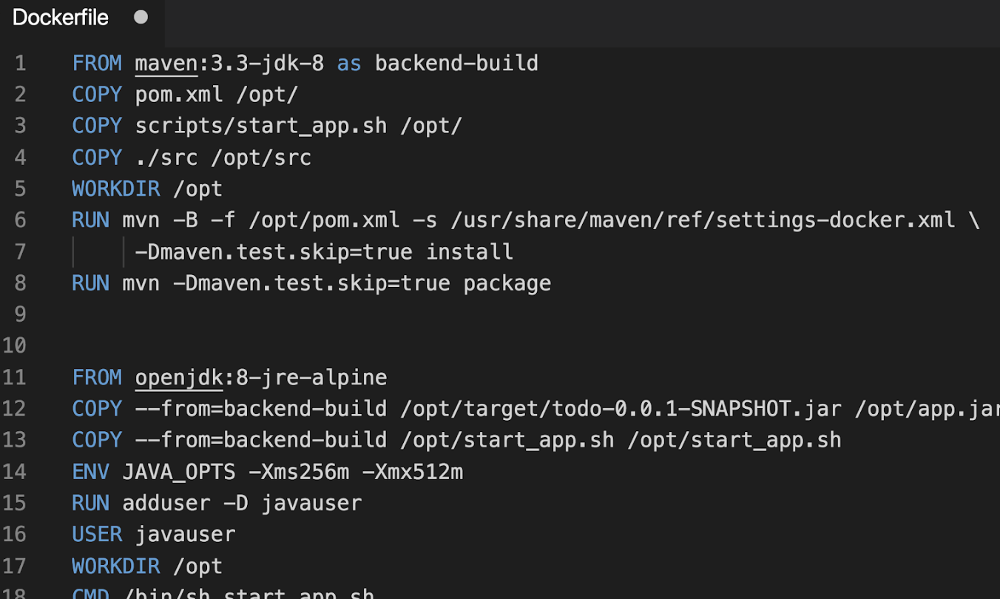

# Multi-stage build!

Existe en Docker desde el engine v17.05.

Con el uso de multi-stage build, se usa múltiples declaraciones `FROM` en el `Dockerfile`, y además, se puede acceder a los archivos de otras imágenes con el comando `COPY`.

|Objetivo|Resultado|
|---|---|
|runtime|compilers, debuggers :(|
|configuration|linters, tests, profilers :(|
|application|code, build and test logs :(|
||runtime|
||configuration|
||application|




# Tamano de una imagen
```bash
...
docker-compose images
docker history <nombre_del_contenedor>
...
```
